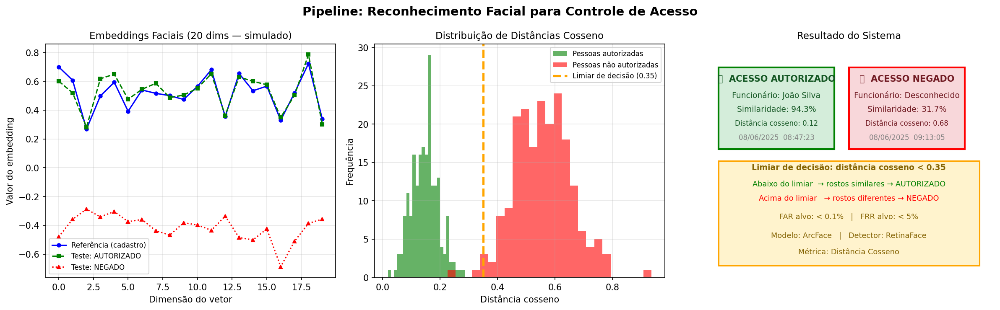

# Projeto de IA — Reconhecimento Facial para Controle de Acesso

---

## Contextualização

Em ambientes industriais, laboratórios e data centers, o controle de acesso
inadequado pode gerar riscos à segurança física, roubo de propriedade
intelectual e violação de normas regulatórias. Este projeto estrutura uma
solução de Inteligência Artificial baseada em reconhecimento facial para
substituir o sistema tradicional de crachás físicos, aumentando a segurança
e a rastreabilidade dos acessos.

---

## Situação-Problema

Uma empresa deseja melhorar o controle de acesso a uma área restrita. O
sistema atual utiliza crachás físicos, que podem ser perdidos, clonados ou
compartilhados. A proposta é desenvolver um sistema que compare uma imagem
facial capturada na entrada com uma base de referência cadastrada e decida
automaticamente se o acesso deve ser **AUTORIZADO** ou **NEGADO**.

---

## Estrutura do Projeto

```
ia_reconhecimento/
│
├── pyproject.toml                        # Configuração do projeto e dependências
├── poetry.lock                           # Lock file gerado pelo Poetry
├── README.md                             # Este arquivo
│
├── imagens/
│   ├── referencia/                       # Base de rostos cadastrados (um funcionário por pasta)
│   │   ├── funcionario_01/
│   │   │   ├── foto1.jpg
│   │   │   └── foto2.jpg
│   │   └── funcionario_02/
│   │       └── foto1.jpg
│   └── teste/                            # Imagem de entrada para verificação de acesso
│       └── candidato.jpg
│
├── resultados/                           # Imagens e logs gerados pelo sistema
│   └── pipeline_reconhecimento_facial.png
│
└── src/
    ├── main.py                           # Script principal — executa todas as seções
    ├── secao_01_definicao_problema.py    # Seção 1: Definição do Problema
    ├── secao_02_objetivo_tipo.py         # Seções 2 e 3: Objetivo e Tipo de Problema de IA
    ├── secao_03_dados_tecnicas.py        # Seções 4 e 5: Dados Necessários e Técnicas
    ├── secao_04_metricas_desafios.py     # Seções 6 e 7: Métricas e Desafios
    └── secao_05_reflexao_referencias.py  # Seções 8 e 9: Reflexão Final e Referências
```

---

## Seções do Projeto

| Seção | Conteúdo |
|-------|----------|
| 1 | Definição do Problema — contexto, situação-problema e proposta de solução |
| 2 | Objetivo do Projeto — objetivo geral e específicos |
| 3 | Tipo de Problema de IA — verificação vs identificação facial, embeddings |
| 4 | Dados Necessários — organização das imagens e cuidados éticos (LGPD) |
| 5 | Técnicas e Modelos — DeepFace, ArcFace, RetinaFace, distância cosseno |
| 6 | Métricas de Avaliação — FAR, FRR, acurácia, limiar de decisão |
| 7 | Desafios e Limitações — técnicos, éticos, viés algorítmico, privacidade |
| 8 | Reflexão Final — aprendizados e cuidados para o Desafio Final |
| 9 | Referências — bibliotecas, legislação e bases públicas consultadas |

---

## Pipeline da Solução

```
Imagem de entrada
      ↓
Detecção facial (RetinaFace)
      ↓
Alinhamento do rosto
      ↓
Extração de embedding (ArcFace — 512 dimensões)
      ↓
Comparação com base de referência (distância cosseno)
      ↓
Decisão: distância < 0.35 → AUTORIZADO ✅ | caso contrário → NEGADO ❌
      ↓
Registro em log (data, hora, nome, confiança, decisão)
```

---

## Tecnologias Utilizadas

| Biblioteca | Versão | Finalidade |
|---|---|---|
| deepface | ≥ 0.0.93 | Reconhecimento facial (detecção, embedding, comparação) |
| opencv-python | ≥ 4.10.0 | Leitura e exibição de imagens |
| numpy | ≥ 1.26.0 | Operações matriciais nos embeddings |
| matplotlib | ≥ 3.9.0 | Visualização do pipeline e resultados |
| tf-keras | ≥ 2.19.0 | Backend do DeepFace |

---

## Pré-requisitos

- Python 3.10+
- Poetry 2.x instalado → [python-poetry.org](https://python-poetry.org/docs/)

---

## Como Executar``

### 1. Instale as dependências
```bash
poetry install
```

### 2. Ative o ambiente virtual
```bash
# Windows (PowerShell)
& ".venv\Scripts\activate.ps1"
```

### 3. Execute o script principal
```bash
python src/main.py
```

A figura do pipeline será salva automaticamente em `resultados/pipeline_reconhecimento_facial.png`.

---

## Observação sobre os Dados

As pastas `imagens/referencia/` e `imagens/teste/` estão **intencionalmente vazias**
nesta etapa. Esta prática corresponde à **fase de planejamento e estruturação** do
projeto — os dados e a implementação do sistema funcional serão desenvolvidos no
Desafio Final.

A visualização gerada pelo script utiliza **dados simulados numericamente** para
ilustrar o conceito de embeddings faciais e distâncias cosseno, sem usar imagens
reais de pessoas, conforme orientação ética do enunciado.



---

## Ética e Privacidade

> ⚠️ Reconhecimento facial envolve **dados biométricos sensíveis** (LGPD, Art. 11).

- Não foram utilizadas imagens reais de pessoas sem autorização neste projeto.
- Em produção, cada funcionário deve assinar termo de consentimento explícito.
- As imagens devem ser armazenadas com criptografia e acesso restrito.
- O sistema deve ser transparente — os funcionários devem saber que está em uso.
- Para testes, recomenda-se o uso de bases públicas como
  [LFW](http://vis-www.cs.umass.edu/lfw/) ou imagens sintéticas.

---

## Repositório

[github.com/ricardocr18/firjanSenai_VisaoComputacional](https://github.com/ricardocr18/firjanSenai_VisaoComputacional)