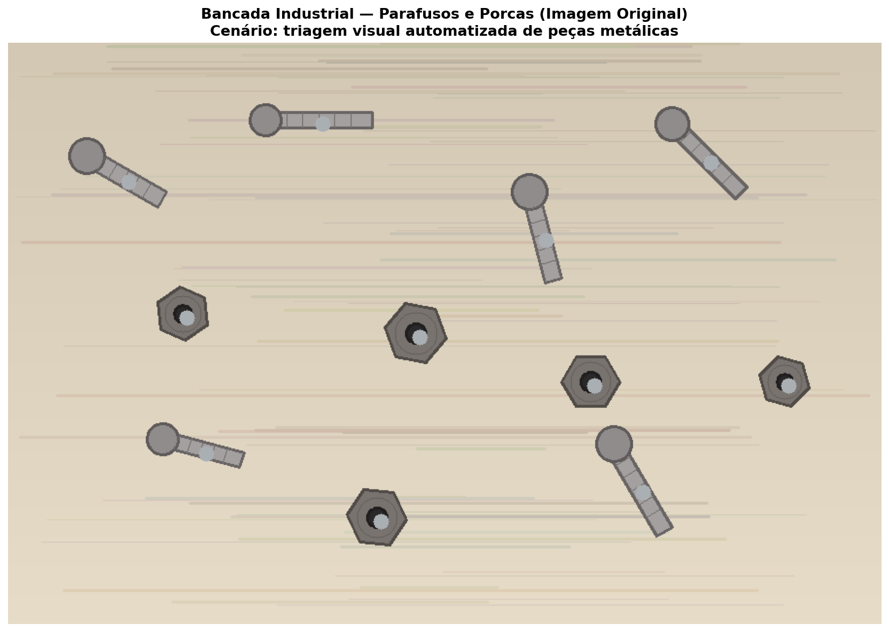
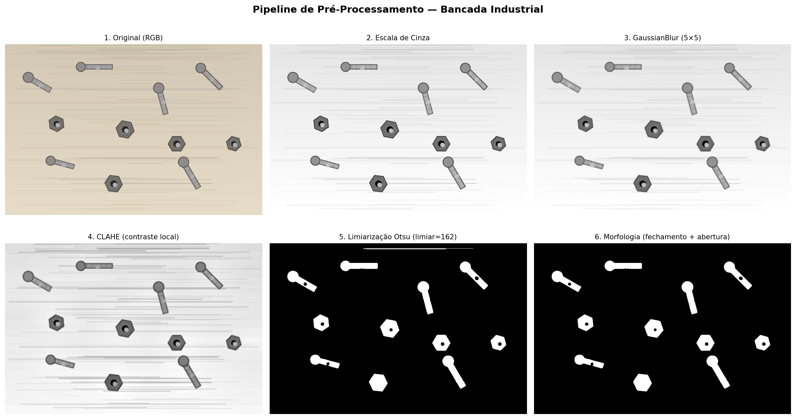
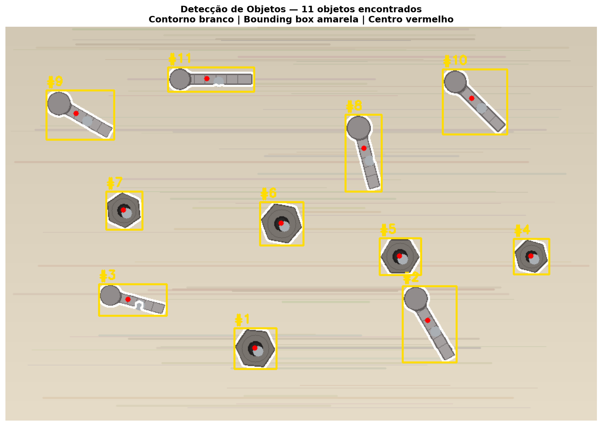
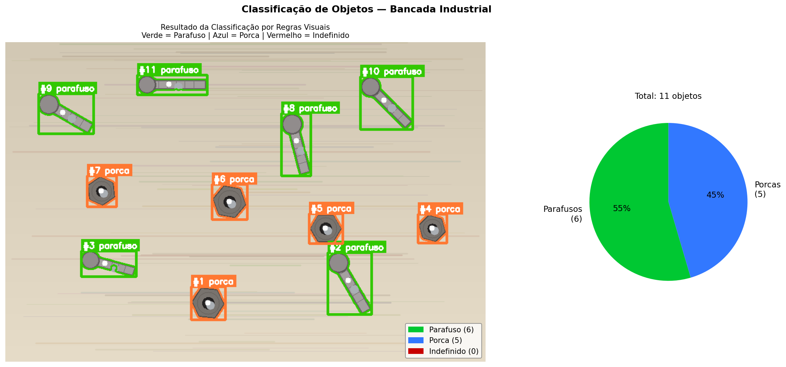
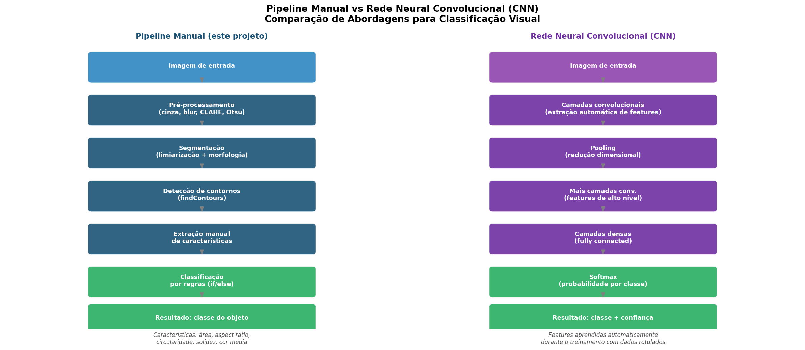

# Desafio 01 - SA — Detecção e Classificação de Objetos com OpenCV e Redes Neurais Convolucionais

---

## Contextualização

Uma equipe de automação deseja criar um protótipo para apoiar a **triagem visual de objetos** em uma bancada industrial. O sistema deve identificar regiões relevantes, destacar os objetos encontrados e classificá-los com base em critérios visuais simples.

Este projeto implementa um **pipeline completo de Visão Computacional** que:
1. Gera uma imagem sintética de bancada com parafusos e porcas
2. Aplica pré-processamento para separar objetos do fundo
3. Detecta cada peça e extrai características visuais mensuráveis
4. Classifica os objetos por regras baseadas nas características extraídas
5. Relaciona o pipeline com Redes Neurais Convolucionais (CNNs)

---

## Estrutura do Projeto

```
openCV_redesNeurais/
│
├── pyproject.toml                      # Configuração do projeto e dependências
├── poetry.lock                         # Lock file gerado pelo Poetry
├── README.md                           # Este arquivo
│
├── imagens/
│   └── bancada_industrial.jpg          # Imagem sintética gerada pelo script
│
├── resultados/                         # Figuras geradas automaticamente
│   ├── 01_imagem_original.png
│   ├── 02_preprocessamento.png
│   ├── 03_deteccao.png
│   ├── 04_classificacao.png
│   └── 05_pipeline_vs_cnn.png
│
└── src/
    ├── main.py                         # Script principal — executa tudo
    ├── secao_01_gerar_imagem.py        # Geração da bancada sintética
    ├── secao_02_preprocessamento.py    # Pipeline de pré-processamento
    ├── secao_03_deteccao.py            # Detecção e extração de características
    ├── secao_04_classificacao.py       # Classificação por regras visuais
    └── secao_05_cnn_analise.py         # Relação com CNNs e análise crítica
```

---

## Pipeline da Solução

```
Imagem de entrada (bancada industrial)
        ↓
Pré-processamento: cinza → GaussianBlur → CLAHE → Otsu → Morfologia
        ↓
Detecção de contornos: cv2.findContours
        ↓
Extração de características: área, perímetro, circularidade, solidez, aspect ratio
        ↓
Classificação por regras:
  circularidade ≥ 0.70 E solidez ≥ 0.95  →  PORCA
  circularidade < 0.55 E solidez < 0.90  →  PARAFUSO
        ↓
Visualização: bounding boxes coloridas + tabela de características
```

---

## Etapa 1 — Cenário e Imagem Sintética

A imagem simula uma bancada de triagem industrial com **6 parafusos** e **5 porcas** distribuídos aleatoriamente sobre um fundo texturizado de madeira clara. Os objetos foram gerados sinteticamente com OpenCV, variando ângulo, posição e nível de ruído para simular condições reais de captura.

**Por que imagens sintéticas?**
- Permitem controlar exatamente quantos objetos existem (ground truth conhecido)
- Eliminam necessidade de fotografar peças reais
- Viabilizam o desenvolvimento e teste do pipeline sem equipamento industrial



---

## Etapa 2 — Pipeline de Pré-Processamento

O pré-processamento prepara a imagem para a detecção, transformando a cena colorida em uma máscara binária onde os objetos aparecem como regiões brancas sobre fundo preto.

| Etapa | Operação | Finalidade |
|---|---|---|
| 1 | Escala de cinza | Reduz 3 canais → 1, simplifica análise |
| 2 | GaussianBlur (5×5) | Suaviza ruído da textura do fundo |
| 3 | CLAHE | Melhora contraste local das peças metálicas |
| 4 | Limiarização Otsu | Separa automaticamente objetos do fundo (limiar=162) |
| 5 | Fechamento morfológico | Fecha buracos internos nos objetos |
| 6 | Abertura morfológica | Remove ruídos isolados do fundo |

**Por que inverter na limiarização?**
As peças metálicas são mais escuras que o fundo de madeira clara. `THRESH_BINARY_INV` converte pixels escuros (peças) em brancos na máscara, permitindo que `findContours` detecte os objetos corretamente.



---

## Etapa 3 — Detecção de Objetos e Extração de Características

Utilizando `cv2.findContours` com `RETR_EXTERNAL`, o sistema detecta apenas os contornos externos de cada objeto (ignorando buracos internos como o furo das porcas). Objetos com área menor que 400px² são filtrados como ruído.

**Características extraídas por objeto:**

| Característica | Fórmula | Interpretação |
|---|---|---|
| Área | `cv2.contourArea(c)` | Tamanho em pixels² |
| Perímetro | `cv2.arcLength(c, True)` | Comprimento do contorno |
| Bounding Box | `cv2.boundingRect(c)` | Retângulo delimitador |
| Aspect Ratio | largura / altura | Forma do bounding box |
| **Circularidade** | `4π·área / perímetro²` | **1.0 = círculo; < 0.5 = irregular** |
| Cor Média | `np.mean(roi)` | Intensidade média na região |
| **Solidez** | `área / área_casco_convexo` | **Preenchimento do casco** |

**Resultado obtido (11 objetos detectados):**

```
 ID     Área  Perímetro   BBox (LxA)  AspRatio  Circular.  CorMédia  Solidez
  1     2862      208.2    64x62         1.03      0.830     136.5    0.977  → porca
  2     3141      317.5    82x116        0.71      0.392     187.7    0.804  → parafuso
  3     2130      283.1   103x48         2.15      0.334     177.6    0.762  → parafuso
  4     2057      174.5    54x54         1.00      0.849     137.4    0.981  → porca
  5     2592      195.9    63x56         1.12      0.848     133.5    0.984  → porca
  6     3009      214.3    66x66         1.00      0.823     138.0    0.978  → porca
  7     2289      186.9    55x58         0.95      0.824     135.2    0.976  → porca
  8     2898      298.2    55x117        0.47      0.410     175.3    0.802  → parafuso
  9     2740      286.3   103x75         1.37      0.420     180.4    0.807  → parafuso
 10     2923      295.1    98x99         0.99      0.422     182.8    0.807  → parafuso
 11     2893      309.9   131x37         3.54      0.379     164.5    0.794  → parafuso
```



---

## Etapa 4 — Classificação por Regras Visuais

A análise dos dados da etapa anterior revelou dois grupos claramente separados:

- **Porcas hexagonais:** circularidade 0.82–0.85 e solidez 0.97–0.98 — forma compacta e regular
- **Parafusos:** circularidade 0.33–0.42 e solidez 0.76–0.81 — forma irregular (cabeça + haste)

> O `aspect_ratio` foi descartado como critério principal porque parafusos em ângulo diagonal aparecem com bounding box quase quadrado, tornando-o um discriminador não confiável.

**Regras aplicadas:**

```python
# PORCA: forma compacta e regular
if circularidade >= 0.70 and solidez >= 0.95:
    classe = "porca"

# PARAFUSO: forma irregular (cabeça circular + haste alongada)
elif circularidade < 0.55 and solidez < 0.90:
    classe = "parafuso"

# INDEFINIDO: zona de transição
else:
    classe = "indefinido"
```

**Resultado: 100% de acurácia**

| Classe | Detectados | Esperado | Acurácia |
|---|---|---|---|
| Parafusos | 6 | 6 | ✅ 100% |
| Porcas | 5 | 5 | ✅ 100% |
| Indefinidos | 0 | 0 | ✅ 100% |



---

## Etapa 5 — Relação com CNNs e Análise Crítica

### Pipeline Manual vs CNN

O pipeline desenvolvido é uma versão **manual e interpretável** do que uma CNN faz automaticamente:

| Pipeline Manual | CNN Equivalente |
|---|---|
| Cinza + blur + CLAHE | Normalização da entrada |
| Limiarização + contorno | Mapas de ativação (feature maps) |
| Área, circularidade, solidez | Features aprendidas pelos filtros convolucionais |
| Regras if/else | Camadas densas + softmax |

A diferença fundamental: no pipeline manual as características são **definidas pelo engenheiro**. Em uma CNN, são **aprendidas automaticamente** a partir de milhares de exemplos rotulados.



### O que funcionou bem
- O CLAHE + Otsu separou eficazmente os objetos metálicos do fundo claro
- A circularidade e solidez provaram ser discriminadores muito mais confiáveis que o aspect ratio neste cenário
- O pipeline é totalmente interpretável — cada decisão tem justificativa numérica rastreável

### Limitações observadas
- O sistema depende de fundo controlado — iluminação variável ou sujeira afetariam a limiarização
- Objetos sobrepostos seriam detectados como um único contorno
- As regras foram calibradas manualmente — um novo tipo de peça exigiria revisão dos limiares
- Sem invariância a escala: uma porca muito grande poderia ter circularidade similar a um parafuso

### Quando usar CNN em vez de regras
- Quando há mais de 2-3 categorias com características visuais similares
- Quando o ambiente não é controlado (iluminação variável, fundo irregular)
- Quando se deseja generalizar para novos objetos sem reescrever regras
- Quando há dados suficientes para treinamento (> 1000 imagens por classe)

---

## Tecnologias Utilizadas

| Biblioteca | Versão | Finalidade |
|---|---|---|
| opencv-python | ≥ 4.10.0 | Geração, pré-processamento, detecção e classificação |
| numpy | ≥ 1.26.0 | Operações matriciais e geração de ruído sintético |
| matplotlib | ≥ 3.9.0 | Visualização de todas as etapas do pipeline |

---

## Como Executar

### 1. Instale as dependências
```bash
poetry install
```

### 2. Ative o ambiente virtual
```bash
# Windows (PowerShell)
& ".venv\Scripts\activate.ps1"
```

### 3. Execute o pipeline completo
```bash
python src/main.py
```

Todos os resultados são salvos automaticamente em `resultados/`.  
Feche cada janela de gráfico para o script avançar para a próxima etapa.

---

## Referências

- [OpenCV — Open Source Computer Vision Library](https://docs.opencv.org/)
- Bradski, G. (2000). The OpenCV Library. Dr. Dobb's Journal of Software Tools.
- Otsu, N. (1979). A threshold selection method from gray-level histograms. IEEE Trans. Systems, Man, Cybernetics.
- LeCun, Y. et al. (1998). Gradient-based learning applied to document recognition. Proceedings of the IEEE.
- Goodfellow, I. et al. (2016). Deep Learning. MIT Press.

---

## 📥 Acesso (Download Facilitado)

1. 🚀 **Visualização Rápida:** [Abrir no Editor Web](https://github.dev/ricardocr18/firjanSenai_VisaoComputacional/tree/main/openCV_redesNeurais) (ou pressione `.` no teclado).
2. 📦 **Download Direto (.zip):** [Clique aqui para baixar apenas esta pasta](https://download-directory.github.io/?url=https://github.com/ricardocr18/firjanSenai_VisaoComputacional/tree/main/openCV_redesNeurais).
