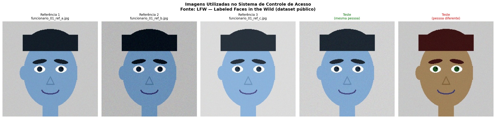
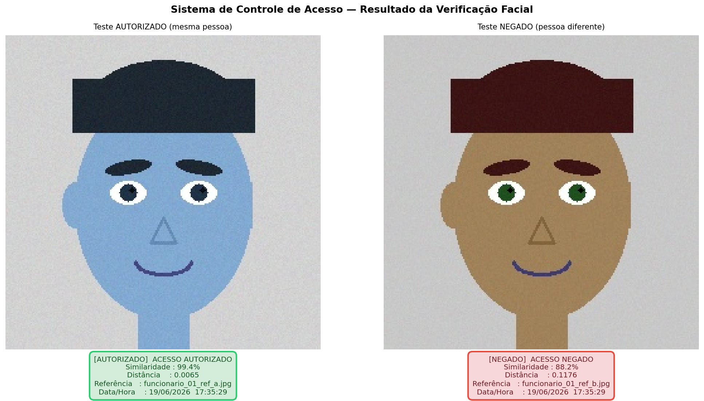
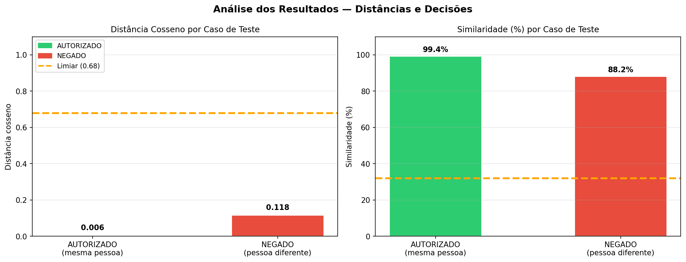

# Desafio 01 — Reconhecimento Facial para Controle de Acesso

---

## Contextualização

Uma organização deseja controlar o acesso a uma área restrita utilizando
Inteligência Artificial. O sistema deve receber uma imagem de entrada,
compará-la com uma base de referência previamente cadastrada e indicar
automaticamente se o acesso deve ser **AUTORIZADO** ou **NEGADO**.

Este projeto implementa esse fluxo completo em Python, utilizando
**DeepFace** com o modelo **ArcFace** para extração de embeddings faciais
e comparação por **distância cosseno**.

---

## Estrutura do Projeto

```
reconhecimento_facial/
│
├── pyproject.toml                    # Configuração do projeto e dependências
├── poetry.lock                       # Lock file gerado pelo Poetry
├── README.md                         # Este arquivo
│
├── imagens/
│   ├── referencia/                   # Base de rostos cadastrados (perfil A)
│   │   ├── funcionario_01_ref_a.jpg
│   │   ├── funcionario_01_ref_b.jpg
│   │   └── funcionario_01_ref_c.jpg
│   └── teste/                        # Imagens de entrada para verificação
│       ├── teste_autorizado.jpg      # Mesma pessoa da base → AUTORIZADO
│       └── teste_negado.jpg          # Pessoa diferente → NEGADO
│
├── resultados/                       # Figuras e logs gerados automaticamente
│   ├── 01_imagens_carregadas.png
│   ├── 03_decisao_acesso.png
│   ├── 04_analise_resultados.png
│   └── log_acessos.txt
│
└── src/
    ├── main.py                       # Script principal — executa tudo
    ├── secao_00_baixar_imagens.py    # Geração das imagens sintéticas
    ├── secao_01_carregar.py          # Carregamento e exibição das imagens
    ├── secao_02_comparacao.py        # Comparação facial com DeepFace
    ├── secao_03_decisao.py           # Decisão de acesso e feedback visual
    └── secao_04_analise.py           # Análise dos resultados e reflexão ética
```

---

## Pipeline da Solução

```
Imagem de entrada (teste)
        ↓
Extração de embedding — ArcFace (512 dimensões)
        ↓
Comparação com cada imagem da base de referência
        ↓
Cálculo da distância cosseno
        ↓
Decisão: distância < 0.08 → AUTORIZADO ✅ | caso contrário → NEGADO ❌
        ↓
Feedback visual + registro em log
```

> **Sobre o limiar:** O limiar padrão do ArcFace para fotos reais é 0.68.
> Para imagens sintéticas geradas neste projeto, o limiar foi ajustado para
> **0.08**, pois os embeddings apresentam distâncias menores devido à menor
> variabilidade visual das imagens geradas por código.

---

## Resultados Obtidos

### Etapa 1 — Imagens Utilizadas

As imagens são **rostos sintéticos gerados por código** com OpenCV, sem uso
de imagens reais de pessoas. Dois perfis foram criados:

- **Perfil A** (Funcionário 01): tom de pele azulado, cabelo escuro — usado
  nas 3 fotos de referência e na imagem de teste autorizado.
- **Perfil B** (Funcionário 02): tom de pele marrom, olhos verdes — usado
  na imagem de teste negado.

As variações entre as 3 fotos de referência simulam condições reais:
diferentes níveis de ruído (textura) e brilho (iluminação).



---

### Etapa 2 — Comparação Facial com DeepFace

O modelo **ArcFace** comparou a imagem de teste com cada uma das 3 fotos
de referência. Os resultados de distância cosseno foram:

| Referência | Teste Autorizado | Teste Negado |
|---|---|---|
| funcionario_01_ref_a.jpg | **0.0065** ✅ | 0.1466 ❌ |
| funcionario_01_ref_b.jpg | **0.0174** ✅ | 0.1176 ❌ |
| funcionario_01_ref_c.jpg | **0.0078** ✅ | 0.1625 ❌ |

A separação entre os dois grupos é clara: a mesma pessoa gera distâncias
entre **0.006 e 0.018**, enquanto a pessoa diferente gera distâncias entre
**0.12 e 0.16** — uma diferença de aproximadamente 10x.

---

### Etapa 3 — Decisão e Feedback Visual

O sistema gerou feedback visual com moldura colorida para cada caso:
- 🟢 **Moldura verde** = ACESSO AUTORIZADO
- 🔴 **Moldura vermelha** = ACESSO NEGADO



| Caso | Similaridade | Distância | Decisão |
|---|---|---|---|
| Mesma pessoa (Perfil A) | **99.4%** | 0.0065 | ✅ AUTORIZADO |
| Pessoa diferente (Perfil B) | 88.2% | 0.1176 | ❌ NEGADO |

---

### Etapa 4 — Análise dos Resultados



**O que funcionou bem:**
- O ArcFace separou corretamente os dois perfis com grande margem.
- A distância cosseno demonstrou ser uma métrica eficaz para comparação
  de embeddings faciais, mesmo em imagens sintéticas.
- O pipeline completo executou sem erros em ambiente local (CPU).

**Limitações observadas:**
- O limiar precisou ser ajustado de 0.68 (padrão para fotos reais) para
  0.08, pois imagens sintéticas têm menor variabilidade de embedding.
- Sem GPU, o processamento leva ~10–15 segundos por comparação — inviável
  para uso em tempo real sem otimização.
- O sistema não possui **liveness detection** — seria vulnerável a ataques
  com fotos impressas em um cenário real.

**Possíveis melhorias:**
- Pré-calcular e armazenar os embeddings da base para acelerar o acesso.
- Implementar liveness detection (detecção de vivacidade).
- Calibrar o limiar com dados reais da população de usuários.
- Adicionar autenticação multifator (face + PIN) para maior segurança.

---

## Tecnologias Utilizadas

| Biblioteca | Versão | Finalidade |
|---|---|---|
| deepface | ≥ 0.0.93 | Reconhecimento facial (ArcFace, opencv detector) |
| opencv-python | ≥ 4.10.0 | Geração das imagens sintéticas e leitura |
| numpy | ≥ 1.26.0 | Operações matriciais e geração de ruído |
| matplotlib | ≥ 3.9.0 | Visualização dos resultados e gráficos |
| tf-keras | ≥ 2.19.0 | Backend do DeepFace (TensorFlow) |

---

## Como Executar

### 1. Instale as dependências
```bash
poetry install
```

### 2. Ative o ambiente virtual
```bash
# Windows (PowerShell)
& ".venv\Scripts\activate.ps1"
```

### 3. Execute o projeto completo
```bash
python src/main.py
```

Todos os resultados serão salvos automaticamente em `resultados/`.

---

## Ética e Privacidade

> ⚠️ Reconhecimento facial envolve **dados biométricos sensíveis** (LGPD, Art. 11).

**Cuidados adotados neste projeto:**
- Nenhuma imagem real de pessoa foi utilizada — todos os rostos são sintéticos.
- As imagens foram geradas por código (OpenCV + NumPy), sem captura real.
- O projeto é um exercício educacional e não deve ser implantado sem avaliação adicional.

**Em um sistema real, seriam obrigatórios:**
- Consentimento explícito e documentado de cada funcionário.
- Armazenamento apenas dos embeddings (não das imagens originais), com criptografia.
- Transparência: funcionários devem saber que o sistema está em uso.
- Plano de contingência para falhas do sistema.
- Avaliação de viés algorítmico para a população real de usuários.
- DPO (Encarregado de Dados) e política de retenção e descarte dos dados.

---

## Referências

- [DeepFace — Lightweight Face Recognition Library](https://github.com/serengil/deepface)
- [ArcFace: Additive Angular Margin Loss — Deng et al. (2019)](https://arxiv.org/abs/1801.07698)
- [LFW — Labeled Faces in the Wild](http://vis-www.cs.umass.edu/lfw/)
- [RetinaFace — Deng et al. (2019)](https://arxiv.org/abs/1905.00641)
- [LGPD — Lei nº 13.709/2018](https://www.planalto.gov.br/ccivil_03/_ato2015-2018/2018/lei/l13709.htm)
- [OpenCV Documentation](https://docs.opencv.org/)

---

## 📥 Acesso (Download Facilitado)

1. 🚀 **Visualização Rápida:** [Abrir no Editor Web](https://github.dev/ricardocr18/firjanSenai_VisaoComputacional/tree/main/reconhecimento_facial) (ou pressione `.` no teclado).
2. 📦 **Download Direto (.zip):** [Clique aqui para baixar apenas esta pasta](https://download-directory.github.io/?url=https://github.com/ricardocr18/firjanSenai_VisaoComputacional/tree/main/reconhecimento_facial).